# ThucHanhPostman

1. Kiểm thử API cơ bản:
- Tạo một yêu cầu GET mới trong Postman.

- Nhập URL của API muốn kiểm thử.
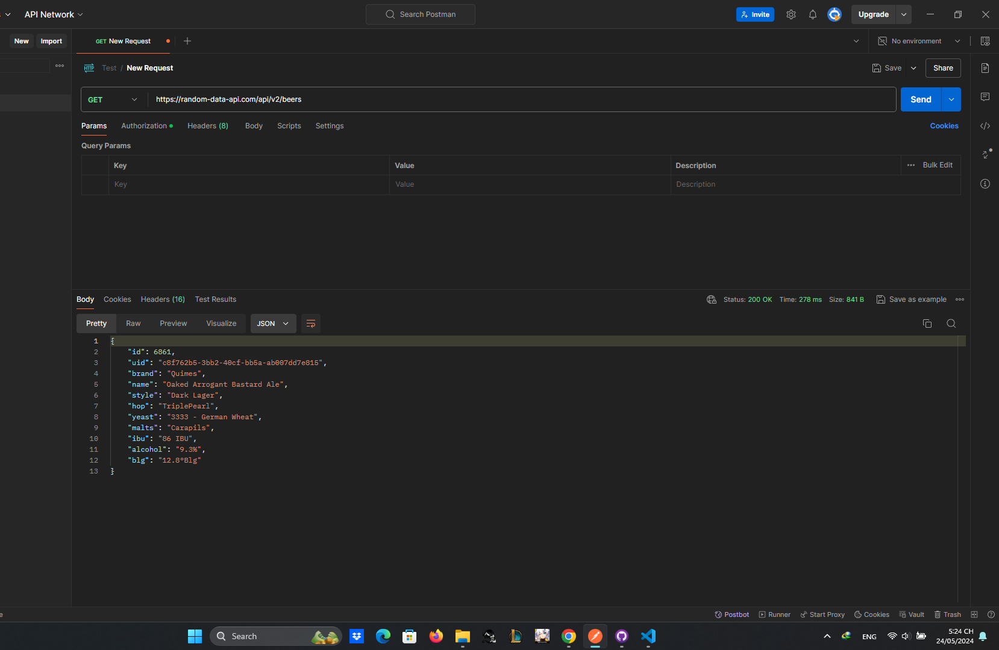

- Gửi yêu cầu và kiểm tra mã trạng thái HTTP và nội dung phản hồi.
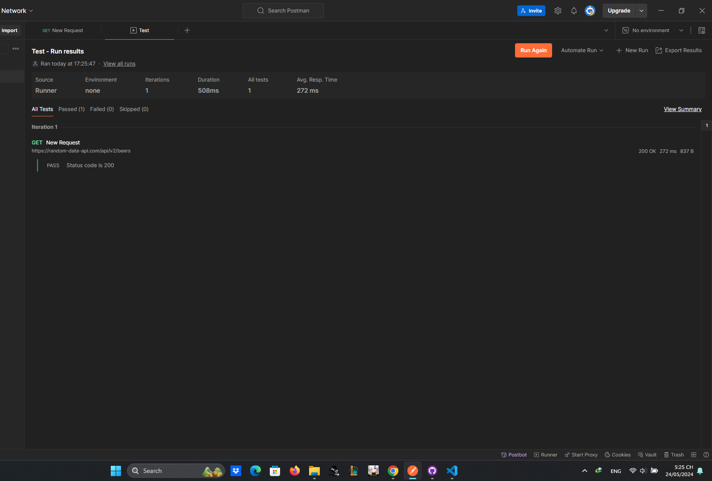

- Thử nghiệm với các yêu cầu HTTP khác (POST, PUT, DELETE).
POST
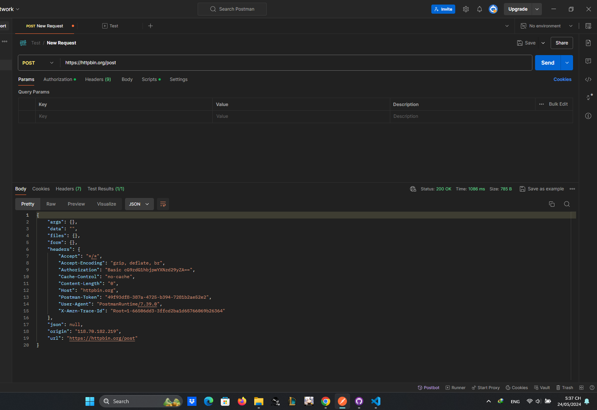

PUT
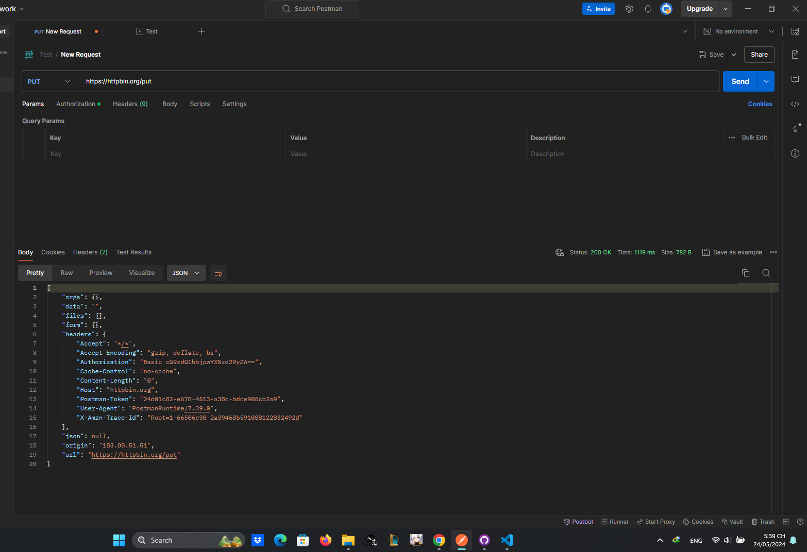
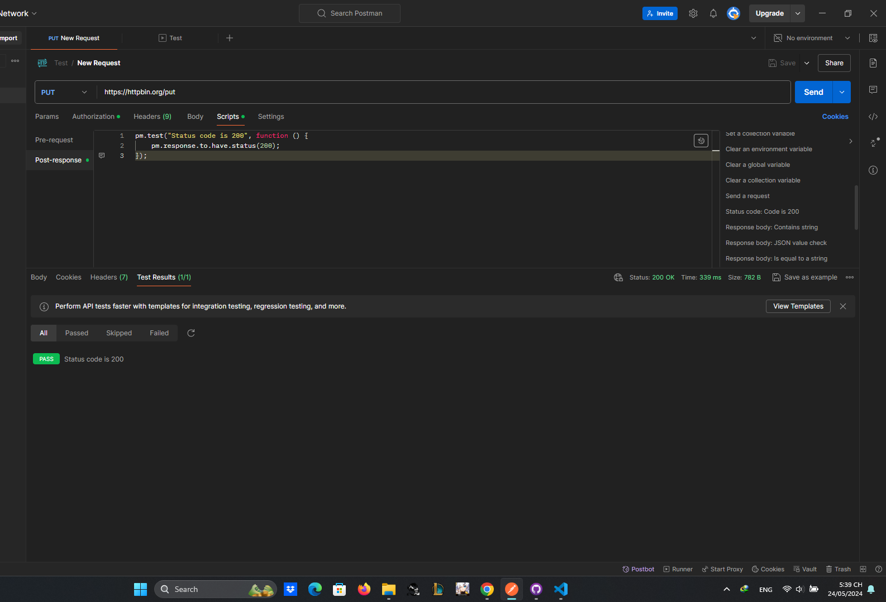

DELETE
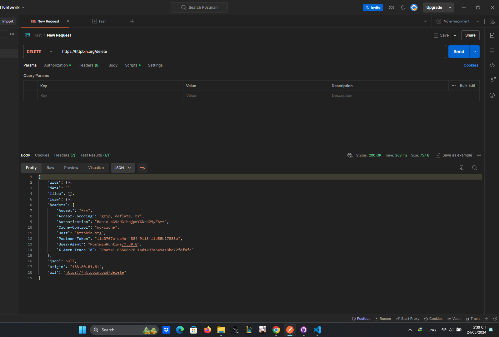
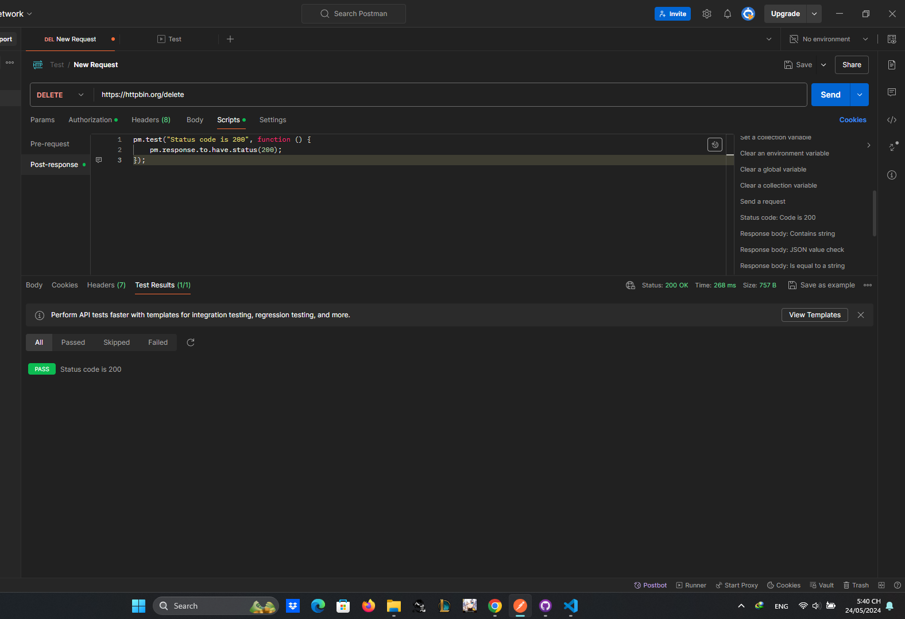

- Sử dụng các biến để lưu trữ và truy cập dữ liệu trong Postman.
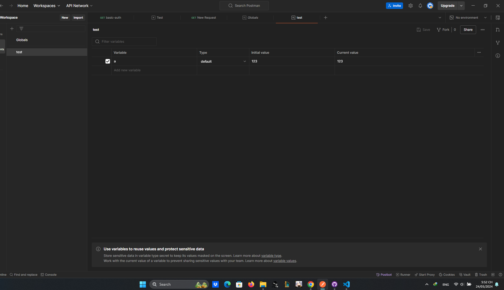

- Tạo bộ sưu tập dữ liệu để quản lý nhiều yêu cầu và biến.
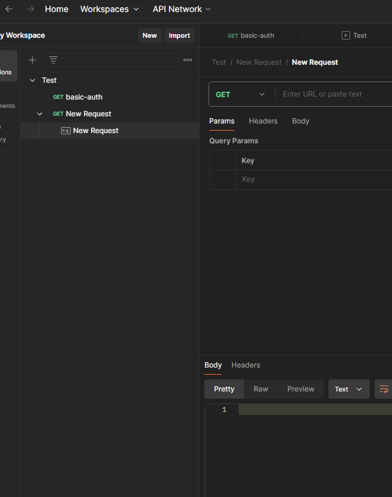

- Xác minh tính hợp lệ của JSON bằng công cụ JSON validator trong Postman.
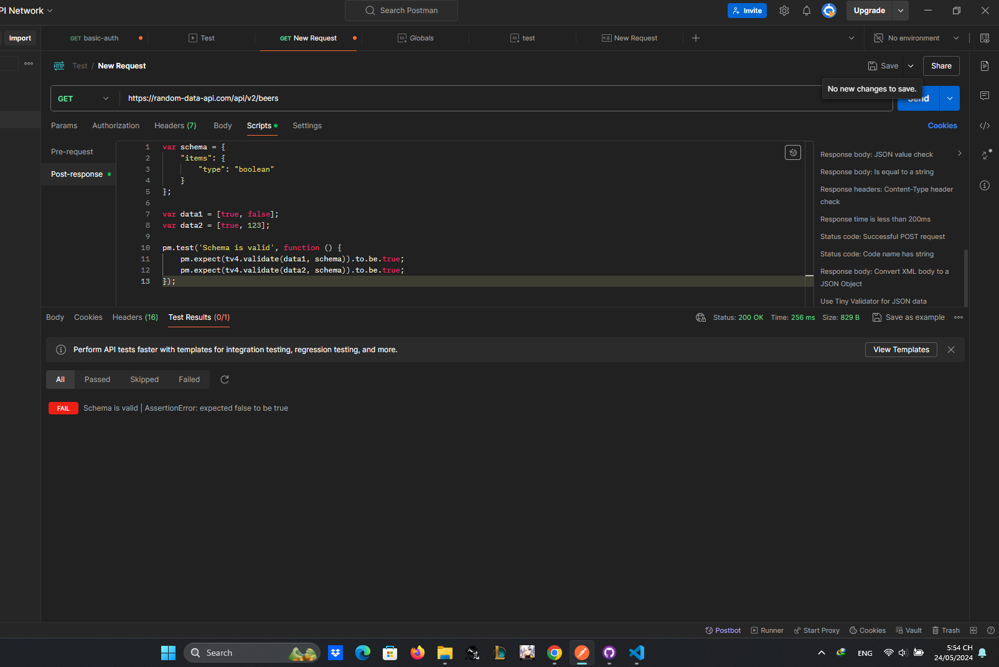

2. Kiểm thử API nâng cao:

- Tìm hiểu về các phương thức xác thực và ủy quyền khác nhau được sử dụng trong API.
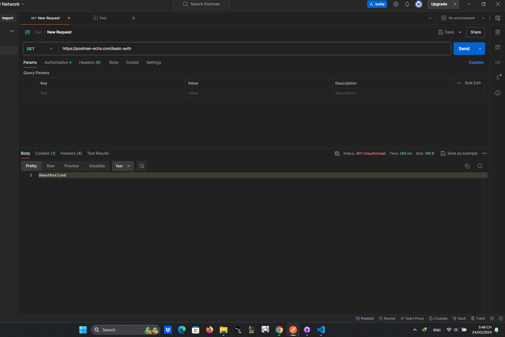

- Viết các yêu cầu HTTP bao gồm thông tin xác thực và ủy quyền.
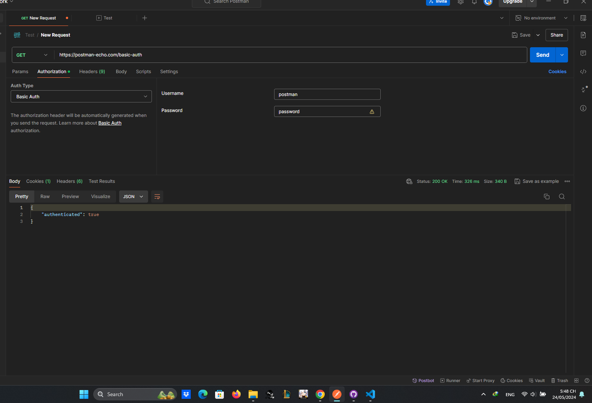

- Sử dụng Postman để kiểm tra hiệu suất API bằng cách đo thời gian phản hồi.
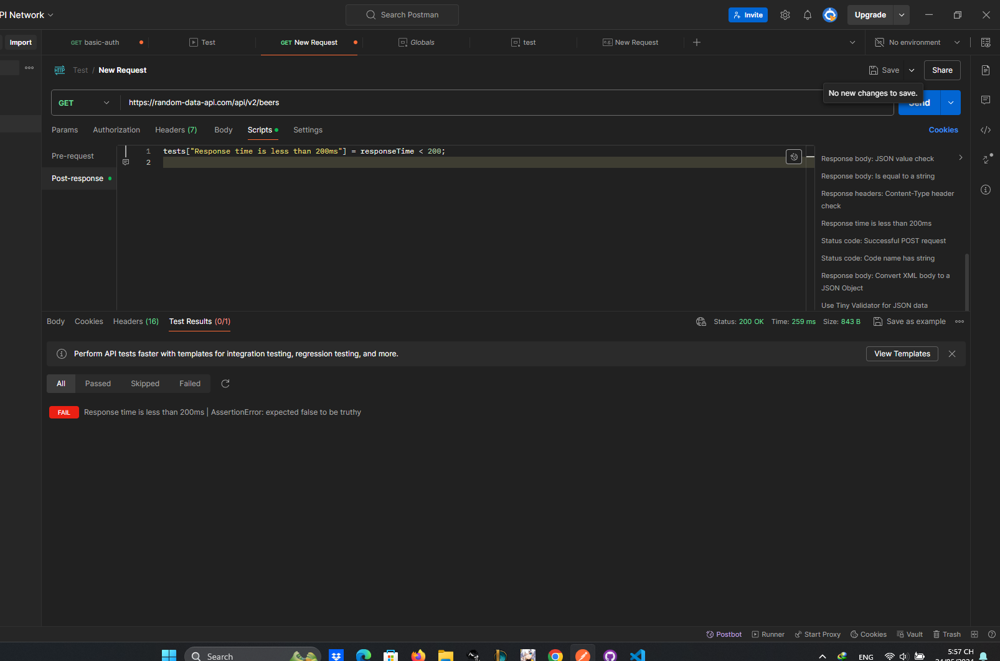

API: https://random-data-api.com/api/v2/beers

Tạo một sản phẩm mới
Trường hợp kiểm thử thành công:
Tên: Tạo sản phẩm mới thành công
Đầu vào:
{
    "brand": "Delirium",
    "name": "Founders Kentucky Breakfast",
    "style": "India Pale Ale",
    "hop": "Galena",
    "yeast": "3638 - Bavarian Wheat",
    "malts": "Victory",
    "ibu": "16 IBU",
    "alcohol": "7.1%",
    "blg": "7.1°Blg"
}
Kỳ vọng: Trả về mã trạng thái 400 và thông báo lỗi chi tiết.

