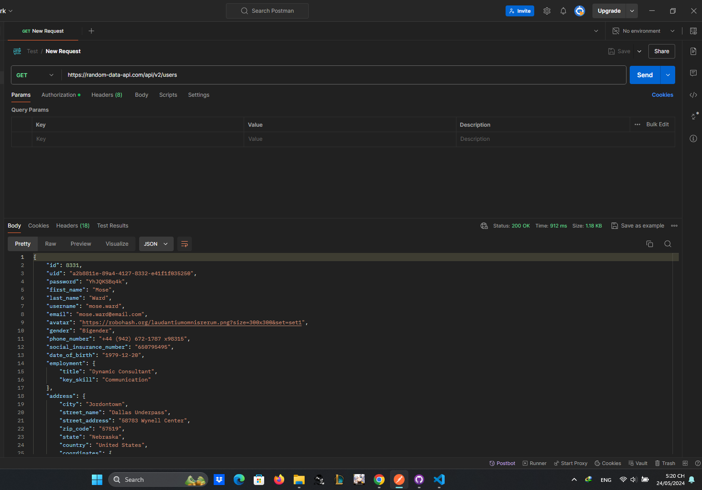

# ThucHanhPostman

1. Kiểm thử API cơ bản:
- Tạo một yêu cầu GET mới trong Postman.

- Tạo một yêu cầu GET mới trong Postman.
- Nhập URL của API mà bạn muốn kiểm thử.
- Gửi yêu cầu và kiểm tra mã trạng thái HTTP và nội dung phản hồi.
- Thử nghiệm với các yêu cầu HTTP khác (POST, PUT, DELETE).
- Sử dụng các biến để lưu trữ và truy cập dữ liệu trong Postman.
- Tạo bộ sưu tập dữ liệu để quản lý nhiều yêu cầu và biến.
- Xác minh tính hợp lệ của JSON bằng công cụ JSON validator trong Postman.

2. Kiểm thử API nâng cao:
- Tìm hiểu về các phương thức xác thực và ủy quyền khác nhau được sử dụng trong API.
- Viết các yêu cầu HTTP bao gồm thông tin xác thực và ủy quyền.
- Sử dụng Postman để kiểm tra hiệu suất API bằng cách đo thời gian phản hồi.
- Tìm hiểu về các lỗ hổng bảo mật phổ biến trong API.
- Viết các yêu cầu HTTP để kiểm tra bảo mật của API.
- Tìm hiểu về các công cụ kiểm thử tự động trong Postman và cách sử dụng chúng để viết các kịch bản kiểm thử.
